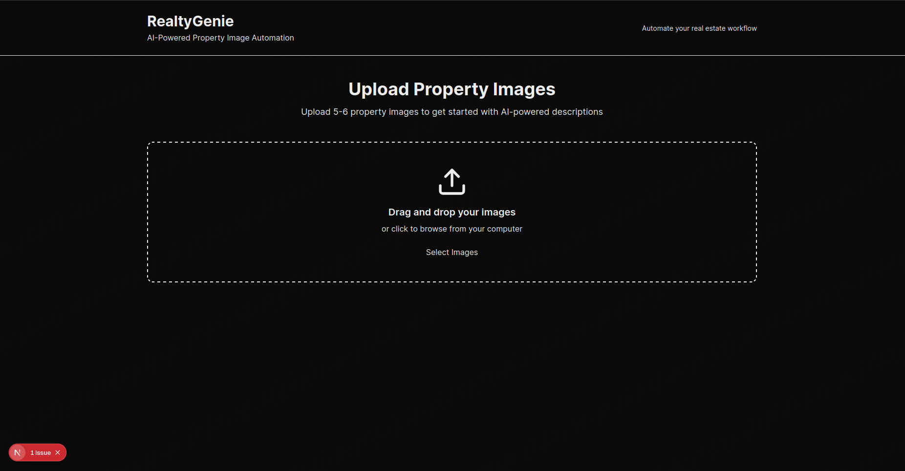
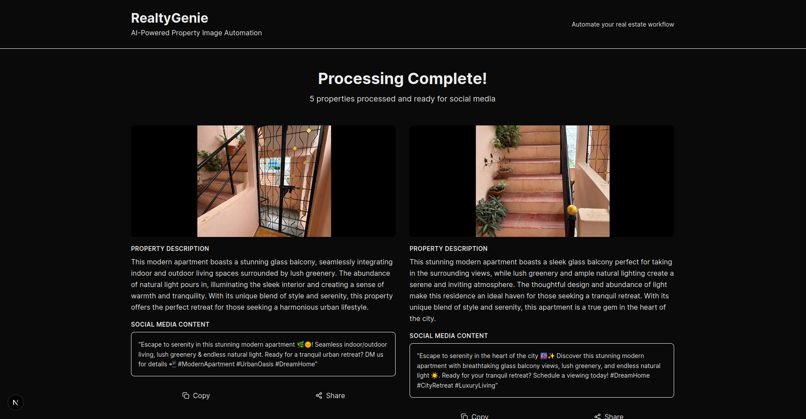
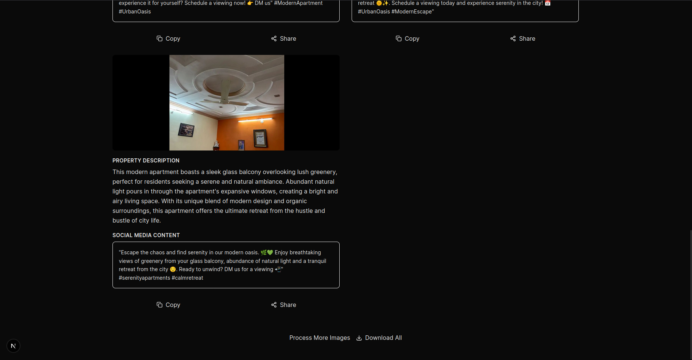

# Next.js Project

This is a [Next.js](https://nextjs.org) project bootstrapped with [`create-next-app`](https://nextjs.org/docs/app/api-reference/cli/create-next-app).

## Demo

### Screenshots


*Home page of the application*


*Result page of the application*


*Result page of the application*

### Video Demo

https://youtu.be/oQVZHp-Wgq8

*Full walkthrough of the application*

## Getting Started

### Prerequisites

- Node.js 18.17 or later
- npm, yarn, pnpm, or bun package manager

### Installation

1. Clone the repository
2. Install dependencies:

```bash
npm install
```

3. Set up environment variables:

Copy the `.env.example` file to `.env` and fill in the required values:

```bash
cp .env.example .env
```

Then edit `.env` with your configuration values.

### Running the Development Server

Start the development server with webpack:

```bash
npm run dev --webpack
```

Open [http://localhost:3000](http://localhost:3000) with your browser to see the result.

You can start editing the page by modifying `app/page.tsx`. The page auto-updates as you edit the file.

## Features

This project uses [`next/font`](https://nextjs.org/docs/app/building-your-application/optimizing/fonts) to automatically optimize and load [Geist](https://vercel.com/font), a new font family for Vercel.

## Learn More

To learn more about Next.js, take a look at the following resources:

- [Next.js Documentation](https://nextjs.org/docs) - learn about Next.js features and API
- [Learn Next.js](https://nextjs.org/learn) - an interactive Next.js tutorial

You can check out [the Next.js GitHub repository](https://github.com/vercel/next.js) - your feedback and contributions are welcome!

## Deploy on Vercel

The easiest way to deploy your Next.js app is to use the [Vercel Platform](https://vercel.com/new?utm_medium=default-template&filter=next.js&utm_source=create-next-app&utm_campaign=create-next-app-readme) from the creators of Next.js.

Check out the [Next.js deployment documentation](https://nextjs.org/docs/app/building-your-application/deploying) for more details.